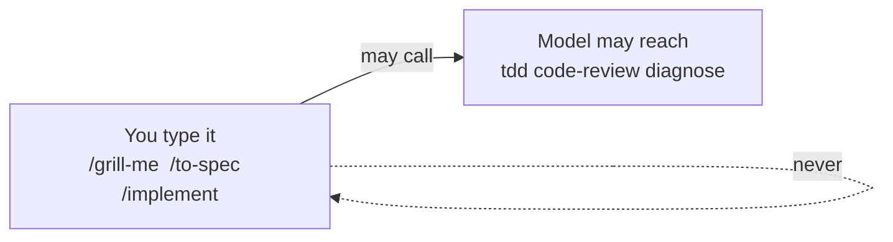
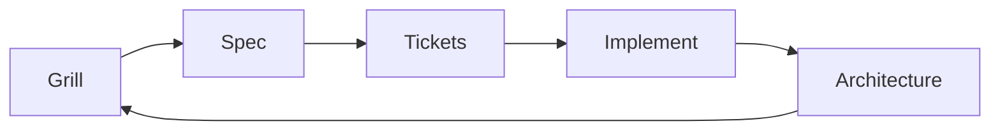
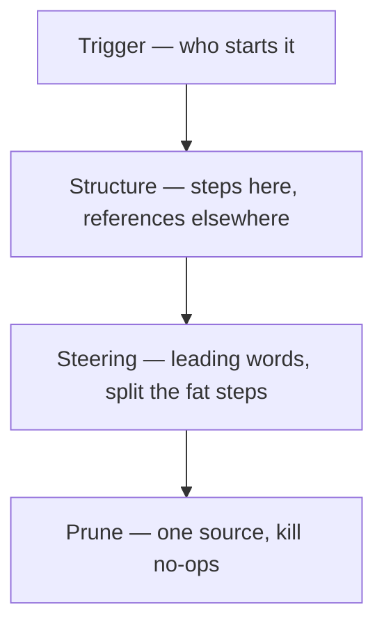

# Teaching graph

## Split



User-invoked skills orchestrate. Their descriptions stay off the context tax until you type them.
Model-invoked skills are small discipline. The agent may reach for them.

A user skill may call a model skill. It may not call another user skill.

## Loop



Grill until language is shared. Write a spec, not a chat dump. Cut vertical slices. Implement with tests and review. Clean the architecture. Feed it back.

## Four pillars



## How vs what

```
SKILL.md     how the agent works          you invoke
MCP server   what the agent can touch    a sheet, a box, a token
```

Third-party “skills as MCP tools” puts every description back in the window. That undoes `disable-model-invocation`. Do not do it.
